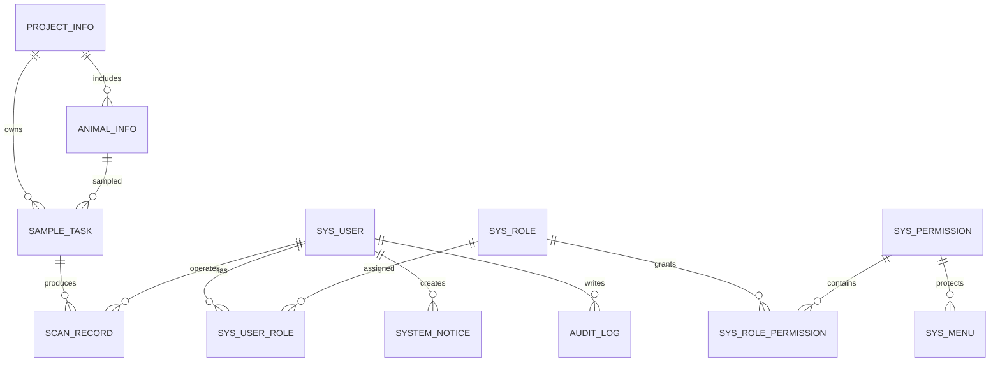

# 数据库设计文档

## 1. 数据库

```text
数据库名：tag_management
字符集：utf8mb4
排序规则：utf8mb4_0900_ai_ci
```

## 2. ER 图



## 3. 核心表

### 3.1 `sys_user`

| 字段 | 类型 | 说明 |
|---|---|---|
| `id` | bigint | 主键 |
| `username` | varchar(64) | 登录账号，唯一 |
| `password_hash` | varchar(255) | BCrypt 密码哈希 |
| `real_name` | varchar(64) | 姓名 |
| `department` | varchar(128) | 部门 |
| `status` | varchar(20) | `ENABLED` / `DISABLED` |
| `created_at` | datetime | 创建时间 |
| `updated_at` | datetime | 更新时间 |

### 3.2 `sys_role`

| 字段 | 类型 | 说明 |
|---|---|---|
| `id` | bigint | 主键 |
| `role_code` | varchar(64) | 角色编码，唯一 |
| `role_name` | varchar(64) | 角色名称 |
| `description` | varchar(255) | 说明 |
| `created_at` | datetime | 创建时间 |
| `updated_at` | datetime | 更新时间 |

### 3.3 `sys_permission`

| 字段 | 类型 | 说明 |
|---|---|---|
| `id` | bigint | 主键 |
| `permission_code` | varchar(128) | 权限编码，唯一 |
| `permission_name` | varchar(128) | 权限名称 |
| `module` | varchar(64) | 所属模块 |
| `created_at` | datetime | 创建时间 |
| `updated_at` | datetime | 更新时间 |

### 3.4 `project_info`

| 字段 | 类型 | 说明 |
|---|---|---|
| `id` | bigint | 主键 |
| `project_code` | varchar(64) | 项目编号，唯一 |
| `project_name` | varchar(128) | 项目名称 |
| `test_article` | varchar(128) | 供试品 |
| `sponsor` | varchar(128) | 委托方 |
| `owner_id` | bigint | 负责人 |
| `status` | varchar(20) | 状态 |
| `created_at` | datetime | 创建时间 |
| `updated_at` | datetime | 更新时间 |

### 3.5 `animal_info`

| 字段 | 类型 | 说明 |
|---|---|---|
| `id` | bigint | 主键 |
| `project_id` | bigint | 项目 ID |
| `animal_no` | varchar(64) | 动物号 |
| `group_no` | varchar(64) | 组别 |
| `gender` | varchar(20) | 性别 |
| `status` | varchar(20) | 状态 |
| `created_at` | datetime | 创建时间 |
| `updated_at` | datetime | 更新时间 |

### 3.6 `sample_task`

| 字段 | 类型 | 说明 |
|---|---|---|
| `id` | bigint | 主键 |
| `project_id` | bigint | 项目 ID |
| `animal_id` | bigint | 动物 ID |
| `label_code` | varchar(160) | 标签码，唯一 |
| `tube_no` | varchar(64) | 管号 |
| `sample_type` | varchar(64) | 样本类型 |
| `time_point` | varchar(64) | 时间点 |
| `planned_collect_date` | date | 计划采集日期 |
| `status` | varchar(20) | 任务状态 |
| `bound_by` | bigint | 绑定人 |
| `bound_at` | datetime | 绑定时间 |
| `verified_by` | bigint | 核对人 |
| `verified_at` | datetime | 核对时间 |
| `recorded_by` | bigint | 录入人 |
| `recorded_at` | datetime | 录入时间 |
| `created_at` | datetime | 创建时间 |
| `updated_at` | datetime | 更新时间 |

### 3.7 `scan_record`

| 字段 | 类型 | 说明 |
|---|---|---|
| `id` | bigint | 主键 |
| `task_id` | bigint | 采样任务 ID |
| `label_code` | varchar(160) | 标签码 |
| `action_type` | varchar(30) | `BIND` / `VERIFY` / `RECORD` |
| `expected_summary` | varchar(512) | 系统期望信息 |
| `scanned_payload` | varchar(512) | 实际扫描/录入信息 |
| `result` | varchar(20) | `PASS` / `FAIL` |
| `message` | varchar(512) | 结果说明 |
| `operator_id` | bigint | 操作人 |
| `created_at` | datetime | 创建时间 |

### 3.8 `audit_log`

| 字段 | 类型 | 说明 |
|---|---|---|
| `id` | bigint | 主键 |
| `user_id` | bigint | 操作人 |
| `module` | varchar(64) | 模块 |
| `operation` | varchar(64) | 操作 |
| `business_key` | varchar(160) | 业务主键 |
| `detail` | varchar(1024) | 操作详情 |
| `created_at` | datetime | 创建时间 |

### 3.9 `sys_user_role`

| 字段 | 类型 | 说明 |
|---|---|---|
| `id` | bigint | 主键 |
| `user_id` | bigint | 用户 ID |
| `role_id` | bigint | 角色 ID |

### 3.10 `sys_role_permission`

| 字段 | 类型 | 说明 |
|---|---|---|
| `id` | bigint | 主键 |
| `role_id` | bigint | 角色 ID |
| `permission_id` | bigint | 权限 ID |

### 3.11 `sys_menu`

| 字段 | 类型 | 说明 |
|---|---|---|
| `id` | bigint | 主键 |
| `parent_id` | bigint | 父级菜单 ID，顶级为 `0` |
| `menu_key` | varchar(80) | 菜单唯一标识 |
| `menu_name` | varchar(80) | 菜单名称 |
| `route_path` | varchar(160) | 前端路由路径 |
| `component` | varchar(120) | 前端组件标识 |
| `permission_code` | varchar(128) | 可见所需权限 |
| `icon` | varchar(80) | 前端图标标识 |
| `sort_order` | int | 排序值 |
| `visible` | tinyint | 是否在菜单中展示 |
| `status` | varchar(20) | `ENABLED` / `DISABLED` |
| `created_at` | datetime | 创建时间 |
| `updated_at` | datetime | 更新时间 |

### 3.12 `system_notice`

| 字段 | 类型 | 说明 |
|---|---|---|
| `id` | bigint | 主键 |
| `title` | varchar(160) | 公告标题 |
| `content` | text | 公告内容 |
| `notice_type` | varchar(30) | `INFO` / `WARNING` / `SUCCESS` |
| `publish_status` | varchar(30) | `DRAFT` / `PUBLISHED` |
| `creator_id` | bigint | 创建人 |
| `published_at` | datetime | 发布时间 |
| `created_at` | datetime | 创建时间 |
| `updated_at` | datetime | 更新时间 |

## 4. 索引设计

| 表 | 索引 |
|---|---|
| `sys_user` | `uk_username` |
| `sys_role` | `uk_role_code` |
| `sys_permission` | `uk_permission_code` |
| `sys_user_role` | `idx_user_role`、`idx_role_user` |
| `sys_role_permission` | `idx_role_permission`、`idx_permission_role` |
| `sys_menu` | `uk_menu_key`、`idx_parent_sort`、`idx_permission_code` |
| `system_notice` | `idx_publish_status`、`idx_notice_created` |
| `project_info` | `uk_project_code` |
| `animal_info` | `idx_project_animal` |
| `sample_task` | `uk_label_code`、`idx_project_status`、`idx_animal_timepoint` |
| `scan_record` | `idx_label_code`、`idx_task_action`、`idx_operator_time` |
| `audit_log` | `idx_user_time`、`idx_module_time` |

## 5. 用户管理数据关系

用户管理复用现有 `sys_user`、`sys_role` 和 `sys_user_role`，本次不新增业务表：

- `sys_user.username` 使用唯一索引保证账号不重复。
- `sys_user.password_hash` 仅保存 BCrypt 哈希，不保存明文密码。
- `sys_user_role` 通过唯一键 `(user_id, role_id)` 避免重复分配角色。
- 编辑用户角色时在同一事务中先删除旧关系，再写入新关系。

用户管理权限和动态菜单由增量脚本 `db/migrations/V1_0_3__user_management.sql` 写入。脚本使用幂等插入，可在后端启动时重复执行，不会覆盖已有用户和角色配置。
