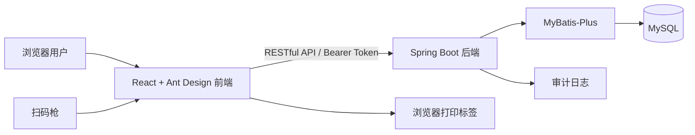
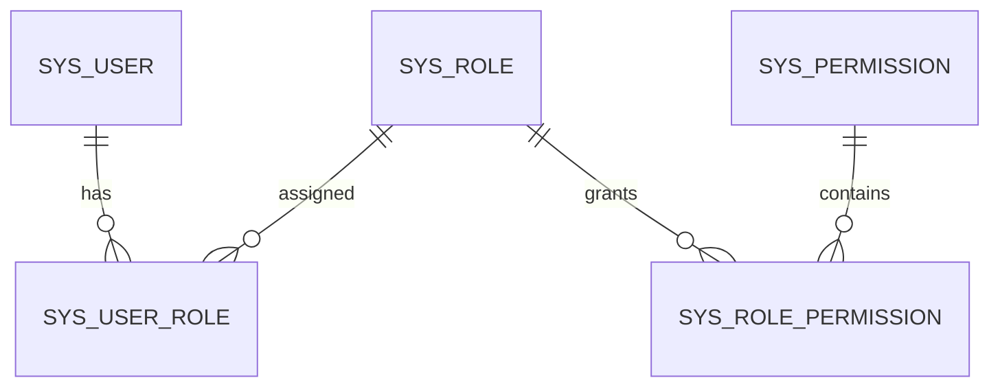
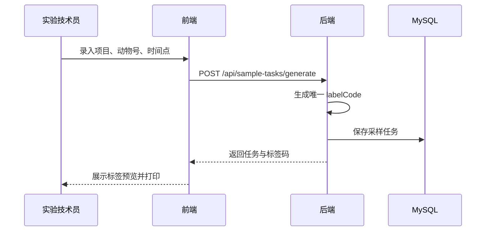
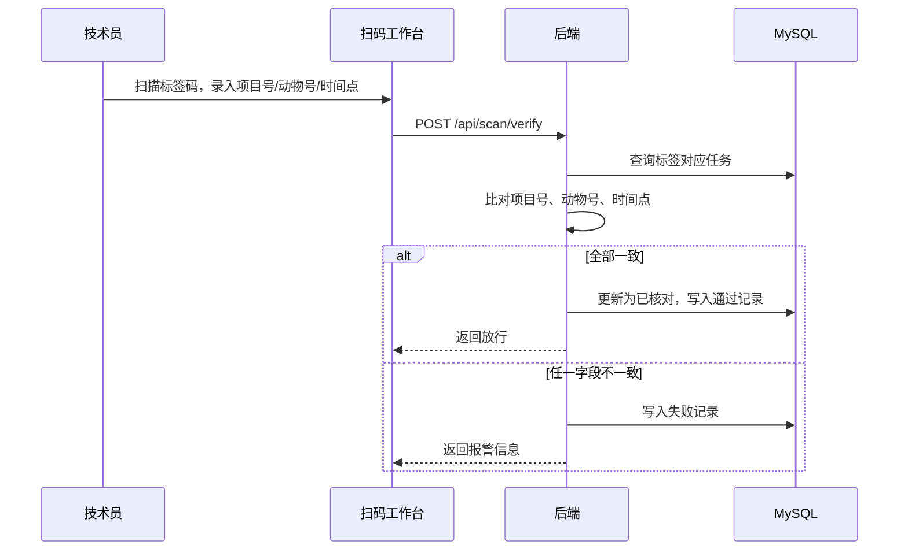
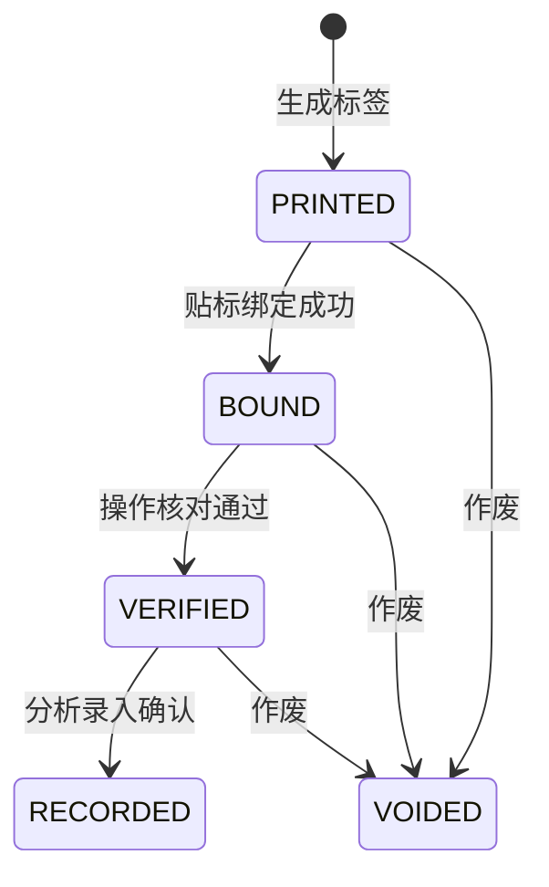

# 概要设计说明书

## 1. 总体架构



## 2. 系统模块

| 模块 | 说明 |
|---|---|
| 登录认证 | 账号密码登录、令牌签发、登录用户信息获取 |
| 权限控制 | 用户、角色、权限、接口注解校验 |
| 项目管理 | 项目编号、项目名称、供试品、负责人维护 |
| 采样任务 | 动物号、时间点、样本类型、管号、标签码生成 |
| 标签预览 | 按双码组合样式展示条码和二维码信息 |
| 扫码工作台 | 贴标绑定、操作核对、录入确认 |
| 记录追溯 | 扫码记录、审计日志、异常失败记录 |
| 异常拦截 | 汇总扫码失败、字段不一致、标签不存在等异常 |
| 统计报表 | 汇总任务状态、扫码动作、通过率和异常率 |
| 菜单管理 | 后台维护菜单树、路由路径、前端组件和权限标识 |
| 权限管理 | 权限点、角色、角色授权维护 |
| 日志管理 | 查看关键操作审计日志 |
| 公告管理 | 维护系统公告草稿、发布状态和首页展示 |

## 3. 权限模型

系统采用 RBAC：



默认角色与权限：

| 角色 | 权限 |
|---|---|
| `ADMIN` | 全部权限 |
| `TECHNICIAN` | 项目查看、任务生成、标签查看、扫码绑定、扫码核对 |
| `ANALYST` | 项目查看、任务查看、录入确认 |
| `AUDITOR` | 项目查看、记录查看、审计日志查看、日志管理查看 |

接口权限由后端注解控制。动态菜单由后端按权限过滤后返回，前端只负责渲染菜单和路由，不能代替后端校验。

## 4. 核心业务流程

### 4.1 标签生成流程



### 4.2 扫码核对流程



## 5. 状态机



## 6. 技术设计

- 前端使用 Vite 管理开发与构建。
- UI 组件使用 Ant Design，表单、表格、状态标签、消息提示保持一致。
- API 请求统一封装在 `frontend/src/api/`。
- 工作台使用 `GET /api/workbench/summary` 聚合指标，避免首页重复计算。
- 后端使用 Spring Boot 3、MyBatis-Plus、MySQL。
- 后端统一响应结构：

```json
{
  "code": 200,
  "message": "操作成功",
  "data": {},
  "timestamp": "2026-07-07 00:38:31"
}
```

- 登录令牌使用 HMAC 签名，过期后需要重新登录。
- 密码使用 BCrypt 哈希存储。
- 应用配置通过 `AppProperties` 统一承接 JWT、令牌有效期和 CORS 来源。
- MyBatis-Plus 启用分页插件和防全表更新/删除插件。
- 数据初始化通过启动器写入默认角色、权限和演示数据。
