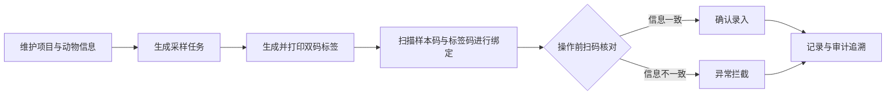
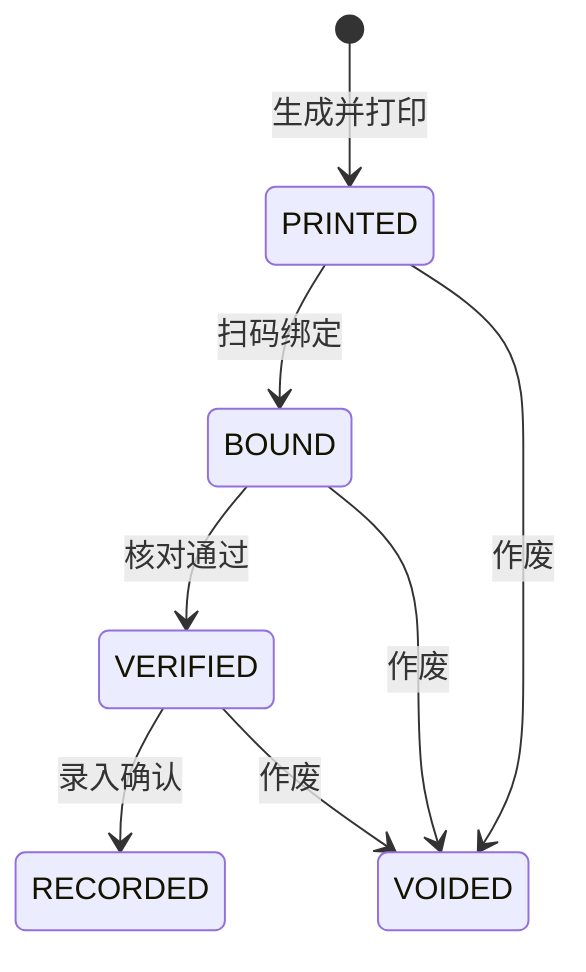
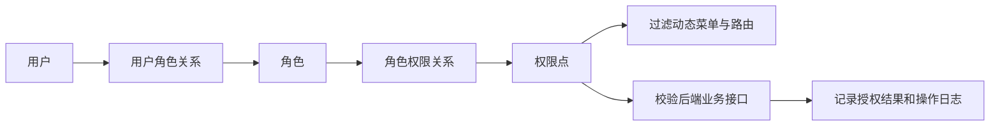
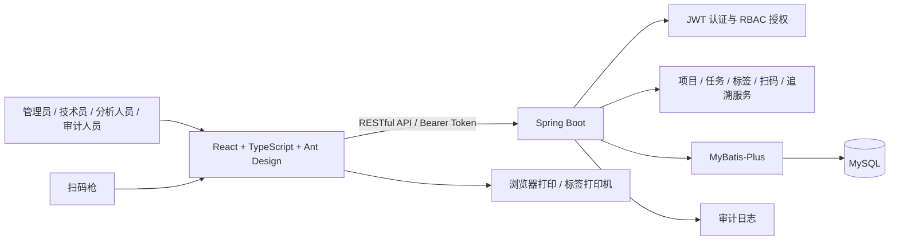

# 采血样品标签防错管理系统整体介绍

## 1. 文档信息

| 项目 | 内容 |
|---|---|
| 项目名称 | 采血样品标签防错管理系统 |
| 项目版本 | 1.0.3 |
| 项目类型 | 前后端分离的实验样品管理系统 |
| 编写日期 | 2026-07-12 |
| 适用对象 | 项目开发人员、测试人员、运维人员、答辩评审人员和业务使用人员 |
| 文档维护 | maorongkang@gmail.com |

## 2. 项目概述

采血样品标签防错管理系统面向动物实验、采血和样品流转场景，用于解决人工填写标签、人工辨认文字和人工核对样品时容易出现的错贴、漏贴、混淆、重复录入及责任难追溯问题。

系统以“任务生成、标签打印、扫码绑定、扫码核对、异常拦截、结果确认、全程留痕”为主线，将原来依赖操作人员记忆和肉眼判断的流程改造成由编码规则、扫码设备和权限体系共同约束的数字化工作流。出现标签与任务不一致时，系统在操作现场直接拦截，同时保存操作人、操作时间、样本条码、标签条码和异常原因，便于后续追溯与统计。

一句话概括：**通过双码标签和扫码核对，把样品标签错误阻止在发生当下，并让每次关键操作都可查询、可审计。**

## 3. 建设背景

项目需求来源于 `ppt/采血样品防错改进研讨.pptx`。现有采血样品处理流程主要存在以下问题：

- 标签内容依靠人工书写或人工选择，容易发生内容错误和格式不一致。
- 样品与标签主要通过肉眼核对，任务集中时容易错贴或串样。
- 采样、贴标、复核和录入分散进行，缺少统一状态管理。
- 异常发现时间偏晚，错误样品进入后续分析环节后处理成本较高。
- 操作记录不完整，难以快速确认异常发生时间、操作人员和影响范围。
- 不同岗位可见范围和操作边界不清晰，存在越权操作风险。

系统建设的核心不是简单保存标签信息，而是建立一套能够主动防错、及时拦截和完整追溯的业务机制。

## 4. 建设目标

### 4.1 业务目标

- 统一项目、动物、时间点、样品类型和标签编码规则。
- 自动生成采样任务及对应标签，减少人工填写内容。
- 使用样本条码与标签条码进行绑定，保证一一对应。
- 在分析、录入等关键操作前进行扫码核对。
- 对条码不一致、重复绑定、状态异常等情况立即拦截。
- 形成从任务生成到结果确认的完整追溯记录。

### 4.2 管理目标

- 通过角色和权限控制不同岗位的菜单与接口访问范围。
- 通过动态路由保证前端菜单与后端授权结果一致。
- 记录登录、配置修改、业务操作和异常信息，满足审计需要。
- 提供公告、统计报表和工作台，集中呈现待办与风险信息。

### 4.3 技术目标

- 采用前后端分离架构，便于独立开发、部署和扩展。
- 使用统一响应结构和全局异常处理，降低前端接口处理复杂度。
- 使用 MyBatis-Plus 规范数据访问，避免在控制器中编写业务逻辑。
- 对输入参数、登录令牌和接口权限进行后端强制校验。

## 5. 使用角色

| 角色 | 主要职责 | 典型操作 |
|---|---|---|
| 系统管理员 | 维护系统基础配置、用户、角色、权限和菜单 | 用户管理、角色授权、菜单配置、公告发布、日志查询 |
| 技术员 | 建立采样任务并完成标签相关操作 | 查看项目、生成任务、预览标签、打印标签、扫码绑定与核对 |
| 分析人员 | 查看待处理任务并确认样品录入状态 | 查询任务、扫码核对、录入确认 |
| 审计人员 | 检查操作过程和异常处理情况 | 查询追溯记录、审计日志、异常拦截和统计报表 |

角色只用于组织权限，实际访问能力由权限点决定。管理员可按岗位创建新角色并组合权限，不需要修改前端代码。

## 6. 核心业务流程



1. 管理员或技术员维护项目及动物基础信息。
2. 技术员根据项目、动物、采样日期、时间点和样品类型生成采样任务。
3. 系统按统一规则生成标签码，页面提供条形码、二维码预览和打印能力。
4. 操作人员扫描样本码和标签码，系统校验后建立绑定关系。
5. 后续操作前再次扫码，系统比较任务、标签和样本信息。
6. 信息一致时允许进入录入确认；不一致时立即阻止操作并生成异常记录。
7. 每次关键动作写入扫描记录和审计日志，形成完整证据链。

## 7. 标签状态管理

系统使用状态机约束标签流转，避免跳过关键步骤或重复执行操作。



| 状态 | 中文含义 | 说明 |
|---|---|---|
| `PRINTED` | 已打印/待绑定 | 标签已生成，可以进行扫码绑定 |
| `BOUND` | 已绑定/待核对 | 样本码与标签码已经建立关系 |
| `VERIFIED` | 已核对 | 扫码结果一致，允许进入录入环节 |
| `RECORDED` | 已录入 | 任务流程已经完成 |
| `VOIDED` | 已作废 | 标签不可继续参与正常业务流程 |

## 8. 功能模块

| 模块 | 功能说明 |
|---|---|
| 登录认证 | 校验账号、密码和用户状态，签发 JWT 令牌并加载当前用户信息 |
| 工作台 | 展示今日任务、已核对、核对通过、异常拦截、待处理和追溯记录等指标 |
| 项目管理 | 维护项目编号、项目名称、负责人及项目状态等基础信息 |
| 采样任务 | 生成和查询采样任务，展示动物、时间点、样品类型和当前状态 |
| 扫码核对 | 完成样本码输入、标签绑定、信息比对、异常提示和录入确认 |
| 标签预览 | 集中展示条形码、二维码及标签内容，支持查询和打印 |
| 追溯记录 | 按任务、条码、操作类型和时间查询完整操作记录 |
| 异常拦截 | 展示条码不一致、重复扫描、状态错误等拦截事件 |
| 统计报表 | 汇总任务、核对通过、异常数量和处理趋势 |
| 菜单管理 | 配置菜单名称、路由、组件标识、图标、排序、层级和启停状态 |
| 权限管理 | 维护角色与权限点，控制业务操作及系统管理能力 |
| 用户管理 | 查询、新增、编辑、启停用户，分配角色并重置密码 |
| 日志管理 | 查询登录、配置变更和业务操作日志，支持责任追踪 |
| 公告管理 | 发布和维护系统公告，在工作台向相关人员展示通知 |

## 9. 权限与动态路由

系统采用 RBAC 权限模型。前端菜单用于改善使用体验，后端接口权限校验负责真正的安全边界。



权限控制流程如下：

1. 用户登录成功后，后端根据用户角色查询有效权限和菜单。
2. 前端根据后端返回的菜单树生成导航，并通过组件标识注册对应的懒加载页面。
3. 未返回的菜单不会注册为可访问路由，直接访问路径时显示无权限状态。
4. 前端按钮根据权限点控制显示和可用状态。
5. 每个受保护接口由后端再次校验权限，不能通过构造请求绕过。
6. 接口返回 `401` 时前端统一清理令牌、用户信息和动态菜单，并返回登录页。

用户管理还包含两项保护规则：当前登录用户不能停用自己的账号，也不能修改自己的角色，防止管理员误操作导致系统失去管理入口。

## 10. 系统架构



### 10.1 前端

- 使用 React、TypeScript 和 Vite 构建单页应用。
- 使用 Ant Design 提供表格、表单、弹窗、菜单和状态提示等基础组件。
- 接口调用统一放在 `frontend/src/api/`，页面组件不直接创建 Axios 实例。
- 公共类型统一维护，TypeScript 开启严格模式。
- 页面按路由懒加载，降低首屏业务代码体积。
- 使用 Layout 组织侧边栏、顶部栏和主内容区，适配常见桌面浏览器尺寸。

### 10.2 后端

- 使用 Spring Boot 提供 RESTful API。
- Controller 负责接收参数和返回结果，Service 负责业务规则，Mapper 负责数据访问。
- 使用 MyBatis-Plus 实现基础查询、分页和防全表更新保护。
- 使用 Bean Validation 校验输入参数。
- 使用全局异常处理统一转换业务异常、参数异常、认证异常和系统异常。
- 使用 JWT 完成无状态认证，并在接口层执行权限校验。

### 10.3 数据库

- 使用 MySQL 保存用户权限、基础信息、采样任务、扫描记录和系统日志。
- 表名与字段名使用小写下划线命名。
- 关键业务编号、用户名和权限编码设置唯一约束。
- 高频查询字段设置普通索引或联合索引。
- 初始化脚本与增量脚本分别管理，已有环境通过增量 SQL 升级。

## 11. 核心数据模型

系统当前由 12 张核心数据表组成：

| 数据域 | 数据表 | 主要用途 |
|---|---|---|
| 用户权限 | `sys_user` | 用户账号、密码哈希、姓名、部门和状态 |
| 用户权限 | `sys_role` | 角色编码、名称和状态 |
| 用户权限 | `sys_permission` | 接口及按钮级权限点 |
| 用户权限 | `sys_user_role` | 用户与角色的多对多关系 |
| 用户权限 | `sys_role_permission` | 角色与权限的多对多关系 |
| 用户权限 | `sys_menu` | 动态菜单、路由、组件和排序配置 |
| 业务基础 | `project_info` | 项目基础信息 |
| 业务基础 | `animal_info` | 动物编号及所属项目信息 |
| 样品任务 | `sample_task` | 采样任务、标签码、样本码和任务状态 |
| 追溯审计 | `scan_record` | 绑定、核对、录入和异常扫描记录 |
| 追溯审计 | `audit_log` | 用户操作、登录和配置变更日志 |
| 系统管理 | `system_notice` | 公告标题、内容、状态和发布时间 |

详细字段、索引和表关系参见 [数据库设计文档](database.md)。

## 12. 接口规范

### 12.1 RESTful 约定

- 查询使用 `GET`。
- 新增使用 `POST`。
- 修改使用 `PUT`。
- 删除或作废使用 `DELETE`，具体以业务语义为准。
- 受保护接口使用 `Authorization: Bearer <token>` 传递登录令牌。

### 12.2 统一返回结构

所有接口使用统一返回类，前端不需要为不同模块编写不同的结果解析逻辑。

```json
{
  "code": 200,
  "message": "操作成功",
  "data": {},
  "timestamp": "2026-07-12T10:30:00"
}
```

常见响应类型包括操作成功、参数错误、未登录、无权限、业务冲突和系统异常。生产环境不会向前端返回原始异常堆栈。

## 13. 安全设计

- 密码使用 BCrypt 哈希保存，用户查询接口不返回密码或密码哈希。
- JWT 密钥长度不得少于 32 位，通过环境变量或 Git 忽略的私有配置维护，不随源码发布。
- 数据库、JWT、CORS、连接池和初始化参数集中配置，避免散落在业务代码中。
- 后端对所有受保护操作执行权限校验，前端菜单隐藏不能代替接口鉴权。
- 创建用户、修改角色、重置密码、启停账号等敏感操作写入审计日志。
- 初始化开关默认关闭，防止普通重启覆盖角色权限或重复写入演示数据。
- 生产环境应替换数据库密码、JWT 密钥和初始化账号密码，并限制允许的 CORS 来源。

## 14. 项目目录

```text
Tag Management/
├─ frontend/                  # React 前端项目
│  └─ src/
│     ├─ api/                 # 接口请求层
│     ├─ components/          # 公共组件和应用布局
│     ├─ pages/               # 业务页面
│     ├─ stores/              # 登录及全局状态
│     ├─ types/               # TypeScript 类型
│     └─ utils/               # 公共工具
├─ backend/                   # Spring Boot 后端项目
│  └─ src/main/
│     ├─ java/com/tagmanagement/
│     │  ├─ common/           # 统一响应、异常和工具类
│     │  ├─ config/           # 安全、MyBatis-Plus 等配置
│     │  ├─ controller/       # REST 接口
│     │  ├─ dto/              # 请求与响应对象
│     │  ├─ entity/           # 数据库实体
│     │  ├─ mapper/           # 数据访问接口
│     │  └─ service/          # 业务逻辑
│     └─ resources/
│        ├─ db/               # 初始化及增量 SQL
│        └─ application.yml   # 应用配置
├─ docs/                      # 项目文档
└─ ppt/                       # 原始业务需求材料
```

## 15. 本地运行

### 15.1 默认端口

| 服务 | 默认地址 |
|---|---|
| 前端开发服务 | `http://localhost:5173` |
| 后端接口服务 | `http://localhost:8080` |
| MySQL | `localhost:3306` |

本项目当前联调环境为前端 `5175`、后端 `8085`，用于避开本机已占用端口；正式使用时以实际配置为准。

### 15.2 启动后端

在 `backend/` 目录执行：

```bash
mvn clean package
java -jar target/tag-management-backend-1.0.3.jar
```

### 15.3 启动前端

在 `frontend/` 目录执行：

```bash
npm install
npm run dev
```

数据库配置、初始化开关、JWT 配置和部署参数参见 [部署说明](deploy.md)。

## 16. 质量与验证情况

版本 1.0.3 已完成以下检查：

- 前端 ESLint 检查通过。
- 前端 TypeScript 编译及生产构建通过。
- 后端 Maven 打包通过。
- 后端 12 项自动化测试通过，其中用户管理服务测试 5 项。
- 管理员用户管理接口访问验证通过。
- 非授权角色访问用户管理接口返回 `403`。
- 动态菜单能够正确返回“用户管理”并注册对应页面。
- 用户列表及详情响应不包含密码和密码哈希字段。
- 当前登录用户自停用和自修改角色保护已覆盖测试。

详细用例和执行记录参见 [测试文档](test.md)。

## 17. 当前完成情况

系统已经形成可运行的第一版业务闭环，能够完成项目维护、采样任务生成、标签预览打印、扫码绑定、扫码核对、录入确认、异常拦截和全程追溯。同时，菜单、角色权限、用户、公告和日志等后台管理能力已经具备，可以支持多岗位协作和后续扩展。

当前版本适合作为内部试运行、课程设计、毕业设计展示或进一步业务联调的基础版本。在接入真实实验室流程前，还需要根据现场扫码设备、标签纸尺寸、打印机型号和业务编码规则进行一次专项验证。

## 18. 后续优化方向

- 将登录令牌调整为更安全的 HttpOnly Cookie 或增加刷新令牌机制。
- 为大数据量列表补充分页、导出和组合筛选能力。
- 引入 Flyway 统一管理数据库版本升级，替代通配符增量脚本加载。
- 增加 Playwright 端到端测试，覆盖登录、动态菜单、任务生成和扫码闭环。
- 按真实标签纸尺寸增加打印模板配置和打印偏移校准。
- 接入真实扫码枪、标签打印机和实验室网络环境进行稳定性测试。
- 继续拆分前端公共依赖，降低 Ant Design 共享包体积。
- 增加日志归档、数据库备份、监控告警和生产部署方案。

## 19. 相关文档

| 文档 | 用途 |
|---|---|
| [环境说明](environment.md) | 开发环境、软件版本和端口配置 |
| [需求规格说明书](requirements.md) | 业务目标、角色和功能范围 |
| [概要设计说明书](design.md) | 系统架构、权限模型和核心流程 |
| [详细设计说明书](detail-design.md) | 模块规则和关键实现设计 |
| [数据库设计文档](database.md) | 表结构、索引和数据关系 |
| [接口设计文档](api.md) | 请求路径、参数和统一响应结构 |
| [测试文档](test.md) | 测试用例、执行结果和风险说明 |
| [部署说明](deploy.md) | 本地启动、配置和部署方法 |
| [用户使用手册](user-manual.md) | 各岗位操作流程 |
| [优化文档](optimization.md) | 已发现问题、优化方案和实施结果 |
| [更新日志](changelog.md) | 各版本新增功能与修复记录 |

