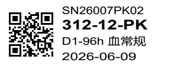

# 小标签打印修复报告

日期：2026-09-17。前端版本：1.0.5。用户确认纸张 25 × 10 mm，打印机 300 dpi。

## 原因与修改

原标签组件宽 282 px、高 268 px，接近方形；缩小放进高 10 mm 的纸张会进一步压缩二维码和文字。原一维图形仅为固定 CSS 渐变，没有编码任何标签数据。打印时所有预览标签又绝对定位到同一位置，可能发生重叠。因此这些是已确认的软件问题，但尚不能排除打印浓度、速度或材料造成的实物质量问题。

新布局采用真实二维码加文字，按 300 dpi 打印点绘制矢量 SVG；每码元 3 点，即 0.254 mm，四周留白 4 码元。当前示例标签码为版本 2，含留白宽 8.382 mm。上限版本 3 含留白宽 9.398 mm，再大则禁止打印并提示更换大标签。二维码仍编码完整原始 `labelCode`，后端和数据库无需调整。

编码复用 Ant Design 已使用的 `@rc-component/qrcode`，直接依赖固定为 1.1.3。该包的编码器内部路径通过固定版本及回归测试约束。文字完整保留，通过行宽排版；无法清晰显示时禁止打印。当前小规格仅提供二维码，不提供一维码。

四周四格留白依据：[DENSO WAVE 二维码区域设计](https://www.qrcode.com/en/howto/code.html)。打印点数与码元大小关系参考：[DENSO WAVE 码元大小](https://www.qrcode.com/zh/howto/cell.html)。实际识读还取决于扫描器分辨率和打印质量。

## 打印隔离与选择

打印区域通过 Portal 放在页面根节点之外，仅渲染当前选中标签。打印时隐藏应用界面和其他预览，页面固定 25 × 10 mm。搜索结果不再包含原任务时重新选中结果首项；空结果或失败清除选择；旧请求晚返回时不得覆盖最新选择。

## 验证

- 原工作台 13 项浏览器回归全部通过。
- 新增 5 项打印回归全部通过，覆盖码元/留白、内容过长、单张打印、搜索更换、空结果、失败保护与乱序响应。
- 前端构建和 lint 通过；未修改后端，无需更新 JAR 或迁移数据库。
- 浏览器生成的打印 PDF 只有一页，读取尺寸约 25.061 × 9.906 mm，差异来自浏览器的 PDF 点数舍入。
- 将打印 PDF 按 300 dpi 栅格化，再使用 OpenCV 独立解码；解出的内容与选中任务完整标签码一致。
- 同时解码 300 dpi 的打印区域截图，结果一致，未出现多张重叠。
- 已查看打印栅格图，二维码留白、项目号、动物号、时间点/样本类型和日期均完整可见。

复现命令：前端目录运行 `npm.cmd test`；根目录运行 `python scripts/verify_label_print.py`。独立解码脚本使用当前验证环境已有的 OpenCV、NumPy、Pillow、pypdfium2，不是前端运行依赖。构建与 lint 使用 `npm.cmd run build` 和 `npm.cmd run lint`。

## 交付边界

本地软件与打印文件验证已完成，前端 1.0.5 已于 2026-09-17 发布至 [服务器标签页面](http://110.40.188.106:8096/labels)。实际标签尚未试打和扫码，不能据此承诺实物一定识别。

发布包为 `.releases/20260917-155550-frontend-1.0.5/tag-management-frontend-1.0.5.zip`，253 个文件，SHA-256 为 `f2b3691b25338e8cd5f7ded00d032d89e811965a08a28780e8b0e307622dc9c6`。服务器完成包摘要与全部文件校验，旧版 188 个文件已备份至 `/opt/1panel/releases/tag-management/20260917-155550-frontend-1.0.5/previous-index`，先发布资源，再原子替换首页。

公网首页、入口 JS/CSS 和标签页面两个组件文件与本地发布包一致，标签路由返回 HTTP 200，后端健康检查为 UP。原账号登录状态下检查了新版标签布局及当前选择与单张打印区域一致，未发现控制台错误。本次仅更新前端，后端、数据库、账号密码及运行端口保持原配置。公网证据保存在本地发布目录的 `public-verification.json`，服务器发布目录保存 `published.json`。

打印 PDF 在 300 dpi 下的测试版式：

文档维护：`maorongkang@gmail.com`。
